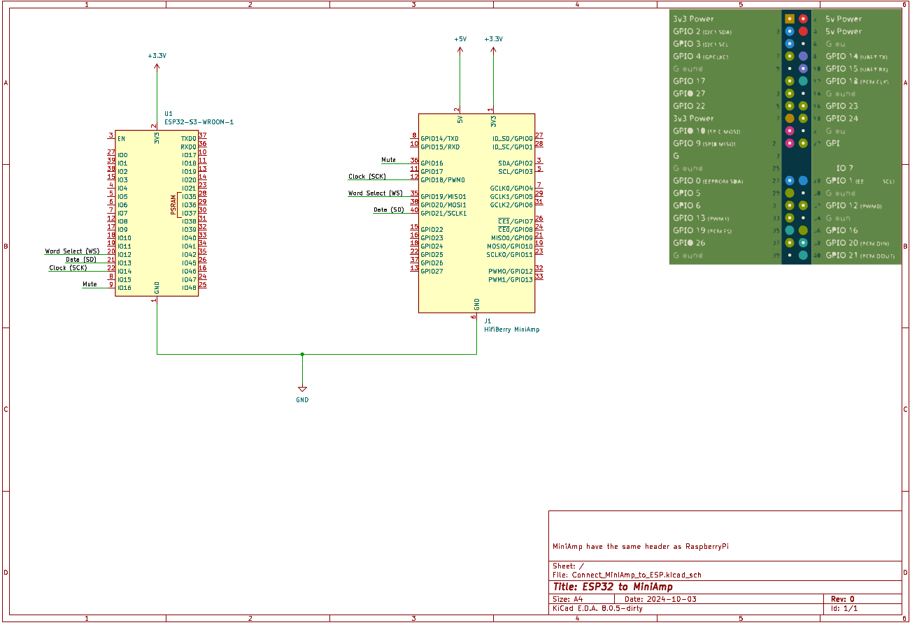

# MiniAmpESP32
Playing music with HiFiBerry MiniAmp and ESP32.

Just a simple test. If you want to use it like that, maybe you have to improve the buffersize of `recv()`.

Connecting your MiniAmp to the ESP (For PDF-File [click here](Wirings/Connect_MiniAmp_to_ESP/Connect_MiniAmp_to_ESP.pdf)):

